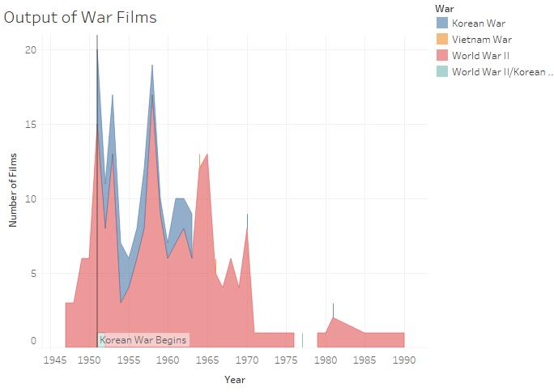

# War Film Production

However, it also presented the Purge Trials, condensed into one trial, as a legitimate case of espionage where, at Davies insistence, all of those accused were proven guilty of an Axis plot to undermine the Soviet military.  Additionally, it passed off the USSR’s invasion of Finland as squelching the threat of Hitler’s friend Mannerheim and the Russo-Germany non-aggression treaty as a stall tactic, not mentioning the USSR’s taking of eastern Poland.

1. First thing
4. Second thing
2. Third thing



However, it also presented the Purge Trials, condensed into one trial, as a legitimate case of espionage where, at Davies insistence, all of those accused were proven guilty of an Axis plot to undermine the Soviet military.  Additionally, it passed off the USSR’s invasion of Finland as squelching the threat of Hitler’s friend Mannerheim and the Russo-Germany non-aggression treaty as a stall tactic, not mentioning the USSR’s taking of eastern Poland.

* Thing 1
* Thing 2
  - Subthing 2

```json
{"_id":"ww2_movies","startUrl":"https://en.wikipedia.org/wiki/List_of_World_War_II_films","selectors":[{"parentSelectors":["_root"],"type":"SelectorElement","multiple":true,"id":"Yearly Table","selector":"table.wikitable tbody","delay":""},{"parentSelectors":["Yearly Table"],"type":"SelectorLink","multiple":true,"id":"Link to Movie","selector":"span.sorttext a","delay":""},{"parentSelectors":["Link to Movie"],"type":"SelectorText","multiple":false,"id":"Title","selector":"th.summary","regex":"","delay":""},{"parentSelectors":["Link to Movie"],"type":"SelectorText","multiple":false,"id":"Director","selector":"tr:contains('Directed by') td","regex":"","delay":""},{"parentSelectors":["Link to Movie"],"type":"SelectorText","multiple":false,"id":"Producer","selector":"tr:contains('Produced by') td","regex":"","delay":""},{"parentSelectors":["Link to Movie"],"type":"SelectorText","multiple":false,"id":"Writers","selector":"tr:contains('Written by') td","regex":"","delay":""},{"parentSelectors":["Link to Movie"],"type":"SelectorText","multiple":false,"id":"Stars","selector":"tr:contains('Starring') td","regex":"","delay":""},{"parentSelectors":["Link to Movie"],"type":"SelectorText","multiple":false,"id":"Music","selector":"tr:contains('Music by') td","regex":"","delay":""},{"parentSelectors":["Link to Movie"],"type":"SelectorText","multiple":false,"id":"Cinematography","selector":"tr:contains('Cinematography') td","regex":"","delay":""},{"parentSelectors":["Link to Movie"],"type":"SelectorText","multiple":false,"id":"Editor","selector":"tr:contains('Edited by') td","regex":"","delay":""},{"parentSelectors":["Link to Movie"],"type":"SelectorText","multiple":false,"id":"Production","selector":"tr:nth-of-type(9) td","regex":"","delay":""},{"parentSelectors":["Link to Movie"],"type":"SelectorText","multiple":false,"id":"Production Company","selector":"tr:contains('Productioncompany') td","regex":"","delay":""},{"parentSelectors":["Link to Movie"],"type":"SelectorText","multiple":false,"id":"Distributed By","selector":"tr:contains('Distributed by') td","regex":"","delay":""},{"parentSelectors":["Link to Movie"],"type":"SelectorText","multiple":false,"id":"Released","selector":"tr:contains('Release date') td","regex":"","delay":""},{"parentSelectors":["Link to Movie"],"type":"SelectorText","multiple":false,"id":"Running Time","selector":"tr:contains('Running time') td","regex":"","delay":""},{"parentSelectors":["Link to Movie"],"type":"SelectorText","multiple":false,"id":"Country","selector":"tr:contains('Country') td","regex":"","delay":""},{"parentSelectors":["Link to Movie"],"type":"SelectorText","multiple":false,"id":"Language","selector":"tr:contains('Language') td","regex":"","delay":""}]}
```
